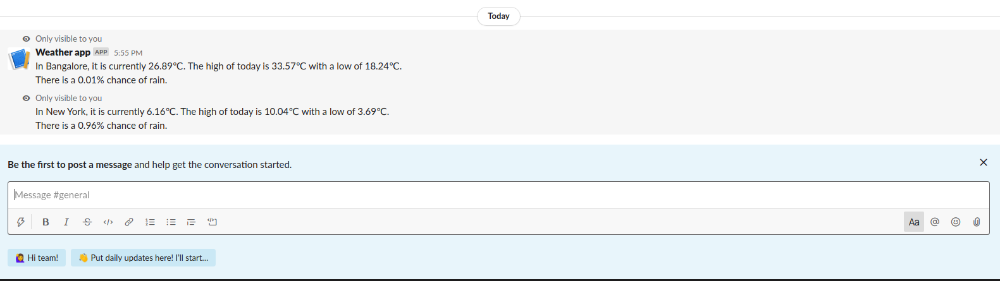

# Weather API for Slack

## Table of contents
* [Introduction](#introduction)
* [Technologies](#technologies)
* [Using this API in Slack](#using-this-api-in-slack)
* [Deploying this API](#deploying-this-api)
* [Sources](#sources)


## Introduction
- This project implements REST-API which is designed to be integrated with a slack-app. Using this API, I have created a slack command (/weather city_name) using which users can see the weather details of the specified city.
- Below is a snapshot of output
  *  
## Technologies
- The project has been implemented using Node.js, AWS lambda, API Gateway and Serverless framework.
## Using this API in Slack
* Create a [slack app](https://api.slack.com/apps?new_app=1) 
* In Basic Information page of your slack app, select `Slack commands` from Add features and functionality dropdown .
  - Click on Create New Command button.
  - In the Command field enter `/weather`. 
  - In the Request URL field add the following link:  https://lidd86rav0.execute-api.us-east-1.amazonaws.com/dev/helloworld
  - click on the save button.
* Click on Install App to Workspace button in the Install your app to your workspace dropdown.
* Yaay!!, you are ready to use the command.

## Deploying this API
* Install and Configure the [serverless framework](https://serverless.com/) with your AWS account.
* Execute the following commands.
```
$ npm install
$ serverless deploy
```
## Sources
- The Project makes use of Dark Sky Api and Geocode API.
  - Geocode API is used to fetch latitude and longitude based on city name provided
  - Dark Sky API is used to fetch weather conditions based on latitude and longitude.


